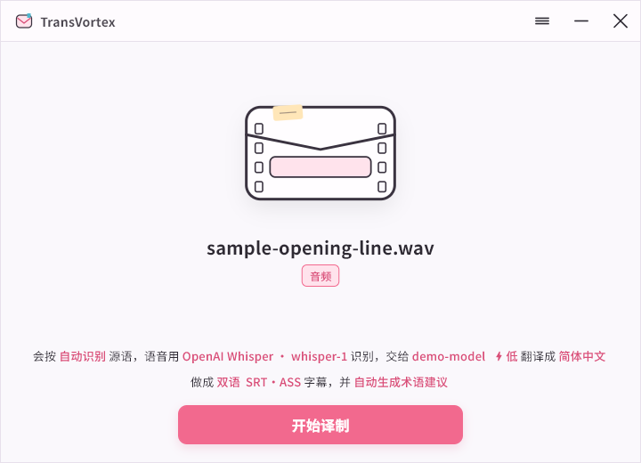

# TransVortex 桌面用户指南

本文面向使用 Windows 桌面安装版的普通用户，覆盖安装、首次配置、制作任务、字幕审看、数据管理和常见故障。CLI、Agent、YAML 字段和协议映射见 [`CONFIG_GUIDE.md`](CONFIG_GUIDE.md) 与 [`../agent/AGENT_USAGE.md`](../agent/AGENT_USAGE.md)。

本文按 `0.1.0` 的公开能力编写。当前正式桌面平台是 Windows x64，安装包尚未进行 Authenticode 签名。桌面界面和本指南当前仅提供简体中文，但字幕的源语言和目标语言不受界面语言限制，实际能力取决于所选模型和服务。英文文档将在后续逐步补充，界面国际化不属于首版范围。



## 1. 开始前需要准备什么

至少需要准备一个可用的翻译模型服务。根据片源类型和识别方式，可能还需要下载本机 Whisper 资源，或者准备远程识别服务的 API key。

| 项目 | 什么时候需要 |
| --- | --- |
| Windows x64 | 当前桌面安装版的运行平台 |
| 翻译模型服务与 API key | 所有翻译任务都需要；SRT 直译也需要 |
| 本机 Whisper 资源 | 选择本机语音识别时按需下载，基础安装包不包含模型 |
| FunASR 服务 | 选择 FunASR 时由用户自行在本机启动兼容服务 |
| OpenAI 或 OpenRouter API key | 选择对应的远程语音识别时需要 |
| 足够的磁盘空间 | 安装应用、本机识别模型以及保存任务和缓存时需要 |

视频、音频和 SRT 的处理方式不同：

- 视频会先检查与源语言匹配的内嵌文本字幕；找到时直接使用，找不到时才需要语音识别。
- 音频始终需要语音识别。
- SRT 直接进入翻译，不需要配置语音识别。

本机优先不等于完全离线。远程语音识别会上传音频，翻译服务会接收字幕文本、上下文和术语信息。选择服务前请确认其隐私政策和计费方式。

## 2. 下载、校验与安装

### 2.1 下载安装包

只从 [TransVortex GitHub Releases](https://github.com/zvensmoluya/TransVortex/releases) 下载 Windows x64 安装包。不要使用聊天附件、网盘转存或来源不明的同名文件。

Release 页面会公布安装包的 SHA-256。下载后可以在 PowerShell 中核对：

```powershell
Get-FileHash -LiteralPath .\TransVortex-0.1.0-windows-x64-setup.exe -Algorithm SHA256
```

文件名以实际下载版本为准。只有计算结果与 Release 页面完全一致时才继续安装。

### 2.2 未签名安装包

`0.1.0` 可能显示“未知发布者”或 Windows SmartScreen 提示。这是首版未签名的已知限制。

只有在以下条件都满足时才继续：

1. 文件来自项目 GitHub Releases。
2. SHA-256 与 Release 页面一致。
3. 文件名和版本符合准备安装的版本。

确认后，可在 SmartScreen 界面选择“更多信息”，再次核对文件名，然后选择“仍要运行”。来源或哈希无法确认时不要绕过提示。

### 2.3 选择安装位置

安装器会建立一个 TransVortex 产品根目录，并在其中分开保存：

```text
TransVortex\
  App\        程序文件，升级时替换
  Data\       任务和恢复缓存
  Resources\  TransVortex 下载的语音识别资源
```

默认位置位于当前 Windows 用户目录。也可以选择其他本地磁盘上的专用目录。不要选择包含其他文件的现有目录，也不要把 `App`、`Data` 和 `Resources` 手工合并或移动。

安装包已包含桌面应用、固定 Python 运行环境和 FFmpeg。普通用户不需要另行安装 Python、PowerShell、FFmpeg 或配置系统 `PATH`。

安装器始终创建开始菜单入口，并默认勾选“创建桌面快捷方式”；如果不需要桌面图标，可以在安装时取消勾选。开始菜单和产品根目录都会提供“卸载 TransVortex”入口。

安装新版本时，如果 TransVortex 仍在运行，安装器会先说明影响并询问是否关闭后继续。确认后会结束该 TransVortex 主进程及其本地服务，再继续更新。已落盘的任务进度仍可恢复，但正在处理的任务会中断，更新前也应先保存尚未提交的字幕编辑。

## 3. 认识主窗口

主窗口负责当前一次制作。中央区域用于拖入或选择片源，底部句子中的高亮内容可以直接点击调整：

- 源语言和目标语言。
- 语音识别方案，仅在片源需要识别时出现。
- 翻译模型和本次思考程度。
- 单语或双语字幕。
- SRT、ASS、VTT、LRC，或 SRT + ASS 输出。
- 是否为本次任务自动发现术语候选，以及要使用哪些持久术语库。

右上角应用菜单提供四个入口：

- **翻译模型设置**：管理模型服务连接、已启用模型、常用模型和网络方式。
- **语音识别设置**：准备本机 Whisper、FunASR、OpenAI Whisper 或 OpenRouter。
- **工作台**：在“任务与字幕”中处理历史任务、审看和重新导出，在“术语库”中维护跨任务复用的术语资产。
- **应用设置**：管理网络、工作数据、识别资源和 Agent / CLI 状态。

关闭主窗口会隐藏到系统托盘，不会退出应用，正在运行的任务和资源下载会继续。单击托盘图标可以恢复窗口；需要完全退出时使用托盘菜单中的“退出 TransVortex”。

## 4. 配置翻译模型

没有可用翻译模型时，主窗口会显示“先配置翻译”。打开“翻译模型设置”后，按下面顺序操作。

### 4.1 添加连接

1. 进入“连接”页签，新建连接。
2. 选择厂商预设，例如 OpenAI、Anthropic、DeepSeek、Google AI Studio 或 Google Vertex；其他兼容服务选择“自定义厂商”和对应协议。
3. 填写容易辨认的连接名称。
4. 检查“服务地址 (Base URL)”。厂商预设通常会提供默认地址；中转网关或自托管服务应填写其模型 API 地址。
5. 填写 API key。
6. 选择“保存连接”。

API key 保存在当前用户的凭据文件中，Provider 配置只保存凭据引用。再次编辑连接时，API key 留空表示继续使用已经保存的凭据，不表示删除。

**Base URL 不是本机代理地址。** Base URL 指模型 API 或中转网关；本机代理在“网络”页签单独设置。

### 4.2 启用模型

保存连接后，应用会尝试读取上游模型列表。上游返回的模型不会自动全部启用：

1. 在“上游可用模型”中选择实际准备使用的模型。
2. 如果服务不支持模型列表，使用“手动填写模型 ID”。模型 ID 必须与服务端要求完全一致。
3. 确认模型出现在“已启用模型”中。
4. 再次保存连接。

只有“已启用模型”才能加入常用模型。上游列表刷新失败不会删除已经启用的模型。

模型翻译设置默认使用“自动（推荐）”即可。只有明确知道模型或渠道容量限制时，才调整每批行数、上下文和输出预算。把行数设得很大不能突破服务端真实限制。

### 4.3 测试连接

选择一个已启用模型后执行“测试连接”。测试会发出一次真实的最小模型请求，用于验证：

- 服务地址与协议是否匹配。
- API key 是否有效且有模型权限。
- 模型 ID 是否可用。
- 当前模型是否接受所选思考程度和请求格式。

测试可能产生少量模型用量。连接测试通过只证明当前最小请求可用，不保证上游服务在长任务中不会限流、超时或改变响应。

### 4.4 设置常用模型

进入“常用模型”页签：

1. 为常用模型选择一个主模型。
2. 按需要加入备用模型，并调整备用顺序。
3. 为主模型和每个备用模型保留“模型默认”思考程度，或选择服务实际支持的档位。
4. 确认当前常用模型已经切换到准备使用的配置。

新任务会使用当前常用模型。主窗口可以临时切换模型或调整本次思考程度；这些选择会写入任务快照，不会改写连接本身。

## 5. 配置网络方式

“翻译模型设置 > 网络”和“应用设置 > 网络”编辑的是同一项全局设置：

| 方式 | 适用情况 |
| --- | --- |
| 跟随系统 | 默认选择；使用 Windows 系统代理，没有代理时直连 |
| 直连 | 明确忽略系统和进程代理，直接访问远程服务 |
| 本地代理 | 使用本机代理软件的 HTTP 或 Mixed 端口 |

选择“本地代理”时只填写端口，例如 `7890`。应用固定连接 `127.0.0.1`，不要填写 SOCKS 端口、完整 URL 或远程代理地址。

该设置同时影响翻译服务、远程语音识别和受管资源下载。本机 Whisper 与本机 FunASR 服务始终直连。修改网络方式后，正在继续的任务也会使用新的全局网络设置。

## 6. 配置语音识别

四种识别方式相互独立，不会在失败时静默切换：

| 方式 | 音频去向 | 开始前需要 |
| --- | --- | --- |
| 本机 Whisper | 留在本机 | 下载运行组件和模型，或验证已有兼容模型 |
| FunASR | 发送到用户自行运行，或由点火器启动的本机服务 | 本机已有兼容的 OpenAI-style FunASR 服务 |
| OpenAI Whisper | 上传到 OpenAI Transcriptions | OpenAI API key 和可用账户 |
| OpenRouter | 上传到 OpenRouter | OpenRouter API key、受支持模型和可用额度 |

### 6.1 本机 Whisper

本机 Whisper 是首版默认识别方案。基础安装包不包含识别运行组件或模型，第一次使用时按需下载。

1. 打开“语音识别设置”，选择“本机 Whisper”。
2. 选择 `small`、`medium` 或 `large-v3`。模型越大，通常需要更多下载空间、内存和处理时间。
3. `0.1.0` 的公开受管路径使用 CPU。未公开的 GPU 选项不属于首版承诺。
4. 确认下载内容、识别资源位置和可用空间。
5. 选择“下载并启用”。

下载会校验固定版本、文件大小和 SHA-256。取消或网络中断后会保留可复用的断点文件；重新操作即可继续。关闭设置窗不会取消下载，托盘会显示当前阶段。

如果准备复用已有模型，选择“使用已有模型”并指定模型目录或其上层目录。应用只接受 faster-whisper / CTranslate2 格式，并且必须实际加载和完成最小转录。原始 PyTorch / Transformers 权重不能直接使用。验证通过后应用只登记原目录，不复制、移动或删除它。

在首次下载前，可以到“应用设置 > 识别资源”更改保存位置。已经存在受管资源、下载断点或活动下载时，首版不会自动搬迁大文件；需要先完成或清理相关资源。

### 6.2 FunASR

TransVortex 不负责安装 FunASR、创建 Python 环境、下载模型、处理 CUDA 兼容问题或提供 FunASR 技术支持。默认方式仍是连接用户自行运行的本机服务。

1. 先在本机自行启动兼容的 FunASR OpenAI-style transcription 服务；若已经保存经验证的启动项，也可以使用下方点火器启动。
2. 在“语音识别设置”选择“FunASR”。
3. 填写本地服务地址和服务实际使用的模型 ID。
4. 保存并设为默认，然后执行“测试连接”。

当前产品要求使用本机回环地址。服务自己的模型、CUDA、进程生命周期、VAD 和时间戳行为由服务维护。连接测试会上传一段最小音频到该本机服务。

#### 已部署服务的一键点火

如果这台电脑的 FunASR 已经由你或 Agent 部署并验证可用，可以在 FunASR 设置页使用“已部署服务点火器”。这不是安装器：它只保存并执行一条已验证的启动配方，然后等待本机健康检查成功。

1. 填写实际的可执行文件绝对路径，例如该环境中的 Python 或已安装的 `funasr-server` 可执行文件。
2. 将启动参数逐行填写；每一行都是一个独立参数，应用不会解析或执行 PowerShell / CMD 命令字符串。
3. 填写可选工作目录，以及该服务实际支持的本机健康检查地址（通常为 `http://127.0.0.1:8899/health`）。
4. 选择“保存并启动”。Local Service 会立即转入“正在启动”，在后台等待健康检查；成功后再进行“测试连接”。也可以只保存启动项，稍后再启动。

点火器只接受 `localhost`、`127.0.0.1` 或 `::1` 的 HTTP 健康检查地址。若地址已经有健康服务响应，界面会显示“外部服务已就绪”，不会再启动第二份，也不会接管或停止外部进程。由点火器启动的进程若未在等待期限内就绪，会自动停止并保留错误和日志；模型加载期间不会阻塞桌面 RPC。

每次启动的标准输出和错误输出分别写入 TransVortex 配置目录下的 `Logs/FunASR`，可从界面直接打开。停止服务会结束该点火器启动的进程树；默认在 TransVortex Local Service 退出时也会停止该服务。可以移除启动项；该操作只删除启动配方，不删除 FunASR 环境、模型或外部服务。

需要 Agent 帮忙时，在 FunASR 页选择“交给 Agent > 配置已部署 FunASR 点火器”。Agent 能通过当前能力契约保存已验证的启动配方，但不会因此获得安装、修复或升级 FunASR 的授权。

### 6.3 OpenAI Whisper

1. 在“语音识别设置”选择“OpenAI Whisper”。
2. 保留官方 Transcriptions 服务地址和模型设置。
3. 填写 OpenAI API key。
4. 选择“保存并设为默认”。
5. 执行“测试连接”。

测试和正式任务都会向 OpenAI 上传所需音频，并可能产生费用。没有 API key 时可以先保存配置，但不能设为可运行的默认方案。

### 6.4 OpenRouter

1. 在“语音识别设置”选择“OpenRouter”。
2. 从应用提供的受支持模型中选择 Whisper 或 Grok。
3. 填写 OpenRouter API key。
4. 选择“保存并设为默认”，再执行“测试连接”。
5. 使用“查询用量”查看该 key 可访问的周期用量和额度信息。

OpenRouter 识别会上传音频并产生模型费用。Whisper 是当前稳定公开 profile；Grok STT 仍是实验能力，长音频、多语言和切句质量需要更多真实内容验证。应用显示的任务用量和 key 用量不等同于最终账单，最终费用以 OpenRouter 账户记录为准。

## 7. 创建字幕任务

### 7.1 选择片源

可以把文件拖入主窗口，也可以点击“选择片源”。当前输入范围：

| 类型 | 支持的常见格式 | 行为 |
| --- | --- | --- |
| 视频 | MP4、MKV、MOV、AVI、WebM、FLV | 默认优先检查匹配源语言的内嵌文本字幕，也可强制运行 ASR 或指定一条可用字幕轨 |
| 音频 | MP3、WAV、M4A、FLAC、AAC、OGG | 始终运行 ASR |
| 字幕 | SRT | 跳过 ASR，直接翻译 |

ASS、VTT 和 LRC 当前是输出格式，不是可用字幕输入。文件选择后，应用会先检查媒体和字幕来源；检查完成前不能开始任务。视频检查完成后，可以点击任务句中的字幕来源，保留“自动选择”、改用“强制语音识别”，或指定一条内嵌文本字幕轨。PGS 等图形字幕轨会显示为不支持，但不能选择。

### 7.2 确认本次任务参数

点击主窗口底部句子中的高亮项逐项确认：

- **源语言**：不确定时可保留自动；专名密集或识别服务自动判断不稳定时建议明确选择。
- **字幕来源**：只对视频显示。默认自动选取匹配源语言的文本字幕，否则使用语音识别；也可强制语音识别或指定一条可用字幕轨。
- **语音识别**：只在音频或确实需要 ASR 的视频中使用。
- **翻译模型**：选择常用模型，或直接选择某个已经启用的模型。
- **思考程度**：默认使用模型建议；临时调整只影响本次任务。
- **目标语言**：选择最终字幕语言。
- **单语 / 双语**：双语会同时保留源文和译文。
- **输出格式**：可选 SRT、ASS、VTT、LRC 或 SRT + ASS。
- **自动发现术语候选**：关闭只表示本次不动态生成新候选，不会删除或禁用已有术语库。
- **使用术语库**：点击主窗口任务句中的入口，只勾选本任务要使用的集合；还没有术语库时，可以直接选择“新建并用于本任务”，创建后会自动带入当前任务的语言范围。任务开始后会固定当前版本，因此后续编辑集合只影响新任务。维护已有术语时，选择“管理术语库”进入工作台。
- **术语使用方式**：添加术语时，通常选择“建议采用”；需要保持固定译名时选择“固定译法”；只有识别或理解帮助、没有固定译文时选择“仅作提示”，这时可以只填写原文。
- **保存任务候选**：完成任务后，在结果工作台点击“术语候选”，只勾选值得长期复用的条目，选择目标术语库并确认。未勾选候选只属于当前任务，不会自动持久化。

新任务默认把成品字幕写到片源所在目录。该目录不可写时，失败恢复会允许选择新的输出目录。

### 7.3 开始与后台运行

选择“开始译制”后，应用才会创建任务并冻结本次参数。运行中会展示当前阶段、分窗或分片计数、模型请求和恢复动作。

任务运行期间可以：

- 选择“取消任务”请求安全取消。
- 关闭主窗口，让任务继续在系统托盘后台运行。
- 打开“工作台 → 任务与字幕”查看任务和事件。

从托盘明确退出时，如果仍有运行或排队任务，应用会要求选择继续后台，或者取消任务并退出。

## 8. 失败、取消与继续任务

主窗口会根据失败类型提供“重试”“继续任务”“去翻译模型设置”“去语音识别设置”或“重新选择片源”等动作。优先使用界面给出的恢复动作，不要手工修改任务目录。

“继续任务”具有严格含义：

- 使用原任务保存的片源、识别方案、主模型与备用模型、格式和其他参数。
- 从已有进度点继续，不用主窗口当前的新任务配置覆盖旧任务。
- 修复凭据或连接问题后可以继续原任务，但在主窗口临时换模型不会改变它。

如果需要换翻译模型重新处理已经保存的识别稿，在“工作台 → 任务与字幕”中使用“重新翻译”。它会按当前翻译设置创建新任务，不重新运行语音识别，并会产生新的翻译模型调用。

取消后的任务如果存在有效进度点，工作台仍可能提供“继续任务”。强制关闭进程不会让已经保存的阶段自动消失，但最后一个尚未完成的阶段可能需要重新执行。

## 9. 审看、编辑与重新导出

任务完成后，主窗口提供“审看结果”“打开字幕”“打开文件夹”和“重新导出”。“审看结果”会进入工作台的“任务与字幕”区域。

### 9.1 工作台

工作台包含“任务与字幕”和“术语库”两个同级区域。“任务与字幕”可以按制作中、待处理、待校对、已完成和已取消筛选任务；选择任务后，根据其状态显示继续、取消、重新翻译、打开目录或重新导出等可用动作。“术语库”用于创建、编辑和删除独立术语库及其条目。

两个区域使用同一个可缩放窗口。切到术语库不会丢弃尚未保存的字幕草稿；返回“任务与字幕”后可以继续编辑。

“待校对”表示任务虽然完成，但仍有质量或交付提醒，或者字幕修改已经保存但还没有重新导出。它不表示任务失败。

### 9.2 编辑字幕

字幕工作区支持：

- 查看全部片段或只查看“有问题”的片段。
- 使用上一条、下一条问题连续检查。
- 修改译文。
- 直接输入开始和结束时间，或按 0.1 秒微调。

空时间、非法格式、负时间，以及结束时间不晚于开始时间会阻止保存。合法但与相邻字幕重叠的时间可以保存，不过质量检查会继续标记。

### 9.3 保存和导出的区别

这是最重要的结果操作边界：

- **保存修改**：更新任务中的结构化字幕和质量状态，不会立刻改写已经导出的 SRT、ASS、VTT 或 LRC 文件。
- **重新导出**：使用当前保存的字幕生成新的成品文件。

看到“修改已保存，字幕文件尚未更新”时，还需要执行“重新导出”。重新导出可以重新选择格式、单语或双语、双语顺序和换行偏好；成功后这些选择成为该任务下一次重新导出的默认方案。

如果成品文件被移动或删除，可以直接重新导出。如果输出目录不可写，选择一个新的空闲目录后重新导出，不需要重新识别或翻译。

存在未保存字幕修改时，关闭工作台或离开当前结果会弹出确认。仅在工作台的两个区域间切换不会丢弃草稿；放弃修改后无法从当前编辑状态恢复。

## 10. 应用设置与本地数据

### 10.1 工作数据

“应用设置 > 工作数据”显示任务和缓存占用，并提供：

- **打开**：打开当前工作数据目录。
- **清理缓存**：删除可重建的媒体和 ASR 临时缓存，不删除任务成果。
- **更改位置**：把 `Tasks` 和 `Cache` 复制、校验并切换到新的专用空目录。

存在运行中、排队任务或活动 Agent 交接时不能迁移。目标文件夹必须为空；迁移验证失败时应用继续使用原位置。

任务资料包含识别稿、翻译状态、质量信息和恢复进度。缓存主要包含音轨、WAV 分片和上传预处理文件。成功任务通常会清理对应缓存；失败或取消任务可能保留缓存，以便继续。

### 10.2 识别资源

“应用设置 > 识别资源”管理 TransVortex 下载的运行组件、模型、断点文件和保存位置。删除当前使用的运行组件或模型会使本机 Whisper 变为未就绪，下次使用需要重新下载或选择其他模型。

用户自行选择并原地使用的外部模型不属于 TransVortex 下载资源，应用不会在这里删除它。

### 10.3 凭据

桌面端保存的 API key 位于当前用户的：

```text
~/.transvortex/auth.json
```

不要把该文件提交到 Git、发送给问题反馈人员或与其他用户共享。Provider YAML 不应包含 API key、token、密码或带凭据的 URL。

### 10.4 卸载

可以从 Windows“已安装的应用”、开始菜单中的“卸载 TransVortex”，或产品根目录中的同名快捷方式启动卸载。实际卸载程序位于 `App\Uninstall.exe`。

交互卸载会把以下内容作为不同选项处理：

- 程序文件始终移除。
- TransVortex 下载的识别运行组件、模型和断点缓存可以单独删除。
- 应用设置与识别登记默认保留。
- 任务工作区与恢复缓存默认保留，删除前会再次确认。
- 用户级 API 凭据默认保留，也可以明确删除。

卸载不会删除用户自己的原始媒体、已经导出的字幕或原地使用的外部模型。重新安装时，保留下来的任务和设置可以继续使用。

## 11. 常见问题与恢复动作

### Windows 阻止安装或显示未知发布者

先确认文件来自 GitHub Releases，并核对 SHA-256。两者任一无法确认都不要继续。确认无误后再从 SmartScreen 的“更多信息”进入“仍要运行”。

### 主窗口显示“先配置翻译”

检查连接是否已经保存、至少一个模型是否位于“已启用模型”、常用模型是否选择了主模型，以及连接测试是否通过。上游可用模型不等于已经启用。

### 翻译连接测试失败

依次检查：

1. Base URL 是否是模型 API 地址，而不是本机代理地址。
2. API key 是否属于该服务并拥有所选模型权限。
3. 模型 ID 是否与上游要求完全一致。
4. “网络”是否选择了正确的系统、直连或本地代理方式。
5. 账户是否被限流、欠费或禁止当前模型。

### 本机 Whisper 显示未就绪

打开“语音识别设置”查看具体缺失项。常见原因包括运行组件或模型尚未下载、磁盘空间不足、已有模型目录失效，或者模型不是兼容的 CTranslate2 格式。不要通过手工复制半成品目录绕过校验。

### 识别资源下载失败

检查全局网络方式、代理端口、目标磁盘空间和写入权限，然后重试。已经完整校验的文件和有效断点会被复用。已有资源时不要手工移动 `Resources`；当前版本不会自动完成跨盘迁移。

### FunASR 无法连接

确认 FunASR 服务已经在本机运行，地址使用回环主机和正确端口，模型 ID 与服务一致，并且 `/v1/audio/transcriptions` 兼容接口可用。若保存过点火器启动项，可使用“启动并等待就绪”或查看其错误日志；否则需由用户或 Agent 启动和修复该服务。

### OpenAI 或 OpenRouter 识别不能设为默认

没有可解析的 API key 时，应用只保存配置，不会把它设为可运行默认方案。补充 key，执行最小连接测试并确认账户权限或额度后再次保存。

### 任务失败后换了模型，但“继续任务”仍使用旧模型

这是预期行为。继续任务必须沿用原任务快照。需要换模型时，在工作台的“任务与字幕”中使用“重新翻译”，从已经保存的识别稿创建新翻译任务。

### 修改字幕后，成品文件没有变化

“保存修改”只更新任务内的字幕。看到“已保存待导出”后执行“重新导出”，成品文件才会更新。

### 关闭窗口后找不到应用

主窗口默认隐藏到系统托盘。单击托盘图标或再次启动 TransVortex 会恢复已有窗口，不会创建第二个任务宿主。

### 输出文件丢失或目录不可写

打开“工作台 → 任务与字幕”，选择对应任务。文件被移动或删除时使用“重新导出”；目录不可写时选择新的输出目录。已经完成的识别和翻译不需要重跑。

## 12. 获取帮助

一般问题和缺陷可以提交到 [GitHub Issues](https://github.com/zvensmoluya/TransVortex/issues)。请提供：

- TransVortex 版本和 Windows 版本。
- 使用的片源类型和语音识别方式。
- 可重复的操作步骤、预期结果和实际结果。
- 经过脱敏的错误信息或 `transvortex doctor --json` 结果。

不要上传 API key、`auth.json`、私有媒体、完整任务目录，或含敏感用户名和路径的未脱敏日志。

如果问题可能导致凭据泄露、任意代码执行或用户数据暴露，不要提交公开 Issue；请按照仓库的 [`SECURITY.md`](../SECURITY.md) 使用私密报告渠道。

需要手工配置 Provider、使用 CLI / Agent 或理解配置优先级时，继续阅读 [`CONFIG_GUIDE.md`](CONFIG_GUIDE.md)。当前能力、隐私摘要和已知限制以仓库根 [`README.md`](../README.md) 为准。
